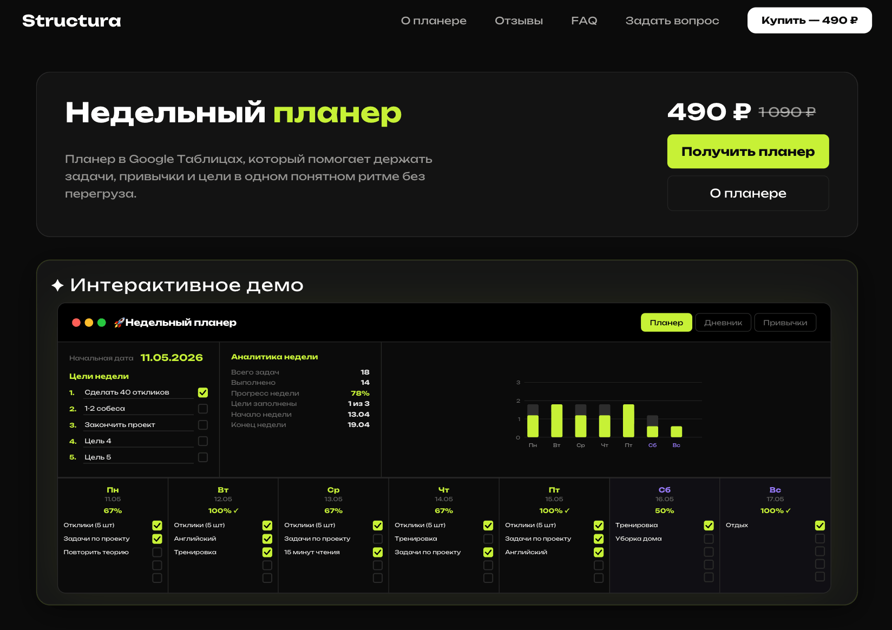

# Structura — SaaS планер продуктивности



**Structura** — коммерческий SaaS-продукт: лендинг с воронкой захвата пользователя, оплатой и доставкой цифрового продукта (планера продуктивности).

Проект решает задачу превращения трафика в оплату с минимальным количеством шагов и высокой конверсией.

---

## 🚀 Демо

👉 https://www.structuraplaner.ru/

---

## 🧩 Основная идея

Пользователь проходит простой путь:

1. Заходит на лендинг
2. Оставляет контакт (email / Telegram)
3. Получает письмо через Resend
4. Переходит к оплате (ЮKassa)
5. Получает доступ к продукту

---

## ⚙️ Стек

**Frontend:**

- Next.js 16 (SSR, App Router)
- React 19
- TypeScript
- SCSS (Sass)

**Интеграции:**

- Resend — отправка заявок и писем
- ЮKassa — прием платежей

**Дополнительно:**

- Swiper — слайдеры
- ESLint — контроль качества кода

---

## 🏗 Архитектура

- SSR (Next.js) для SEO и скорости загрузки
- Компонентный подход (React)
- Минимизация клиентского JS
- Простая и поддерживаемая структура

---

## 📬 Обработка заявок

Флоу без отдельного backend:

- Форма → Resend
- Получение заявки (email / Telegram)
- Отправка ссылки на оплату (ЮKassa)
- После оплаты — выдача доступа

---

## 💳 Монетизация

- Разовая оплата через ЮKassa
- Цифровой продукт (планер продуктивности)

---

## ⚡ Производительность

- Lighthouse: 95+
- SSR рендеринг
- Быстрая загрузка страниц
- Оптимизация ассетов

---

## 📱 Особенности

- Адаптивный UI (mobile-first)
- SEO-оптимизация
- UX, ориентированный на конверсию
- Минимум шагов до оплаты

---

## 🛠 Скрипты

```bash
npm run dev     # запуск dev
npm run build   # сборка
npm run start   # production
npm run lint    # проверка кода
```
